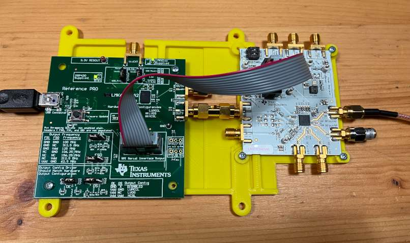

# LMX2594EVM USB2ANY programmer

## Dependencies
 * `pip install hidapi`

## Usage
 * Generate a `HexRegisterValues.txt` file in the TICS Pro app or use the example provided file
 * Run `./lmx.py HexRegisterValues.txt`

## Debugging
To capture and replay commands from the TICS Pro app:

 * Assume you have VirtualBox VM with TICS Pro running
 * `modprobe usbmon`
 * Connect the USB device to the VM
 * `lsusb`, note the Bus and Device ID, e.g. "Bus 001 Device 031: ID 2047:0301 Texas Instruments MSP430 HID Datapipe Example" → Bus 1, Device 31
 * Start Wireshark, select usbmonX device, where X = Bus ID
 * Add filter `usb.device_address == 31` where the number is the Device number noted before
 * Select USB Communications → Write all registers in TICS Pro
 * Save the packets to .pcapng
 * Run `tcpdump -r log.pcapng -x > log.txt`
 * Run `./try.py log.txt`

## Board holder

 * Print `holder.scad`
 * Use 2.5x6 screws for plastic, e.g. Bossard 3034063 or 2000156

## Convert HexRegisterValues.txt to Meteopress radar internal format

 * `dos2unix HexRegisterValues.txt`
 * `cat HexRegisterValues.txt | sed -re "s/^R/\"/" -e "s/\t0x/\":\"/g" -e "s/$/\",/g"`
 * add `{}` to make it a json object
 * save to `config/pll/lmx/registers.json`
